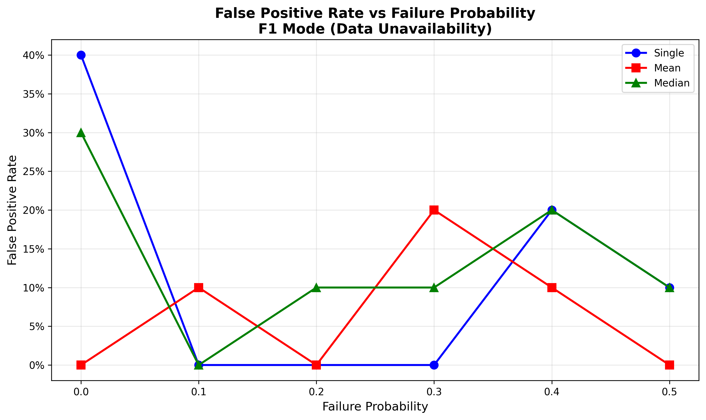
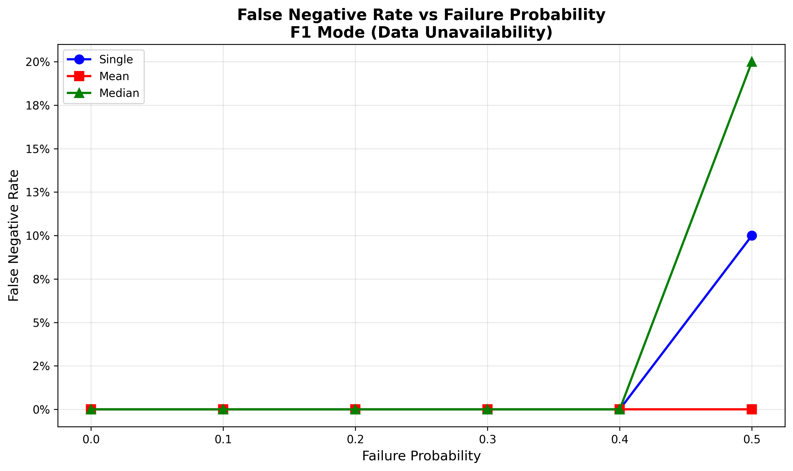
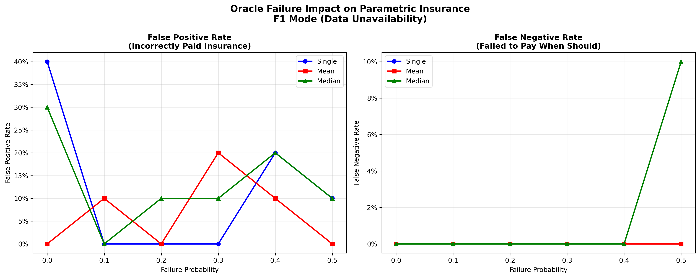

# Chainlink Functions <> Parametric Insurance Sample app

This use case showcases how Chainlink Functions can be used to trigger a parametric insurance to offer payouts to clients, with Chainlink Functions being used to fetch data from 3 different weather APIs for temperature data.

[Parametric Insurance](https://en.wikipedia.org/wiki/Parametric_insurance) offers payouts to clients based upon a trigger event. In the sample, a smart contract will offer payouts based on the temperature in New York City. If the temperature falls below 60 degrees Fahrenheit (you can define a different threshold) for three consecutive days, the insurance will pay the client with their balance.

There is a smart contract called `ParametricInsurance` created for this use case, and clients can get payout if the predefined conditions in the smart contract are met.

In the `ParametricInsurance`, anyone can call the function `executeRequest` (with a limit of one call per day) and send a request to Chainlink Functions. After the request event is detected by an off-chain Chainlink node, the node will fetch the data and execute the computing logic defined in `Parametric-insurance-example.js`.

After results are calculated, the returned data will be passed through [Chainlink Off-Chain Reporting mechanism (Chainlink OCR)](https://docs.chain.link/architecture-overview/off-chain-reporting/) to be aggregated. After the data aggregation, Chainlink Functions will call the `fulfillRequest` function and the client will be paid if the predefined condition (three consecutive cold days in this case) is met.

## Key Features

- **Real-time Weather Data**: Fetches temperature data from 3 independent weather APIs
- **Chainlink Functions Integration**: Secure off-chain computation and data aggregation
- **Automated Payouts**: Triggered automatically when conditions are met
- **Extensible Design**: Easy to modify thresholds, data sources, and payout logic
- **Oracle Failure Research**: Includes comprehensive framework for testing oracle reliability and failure modes
- **Custom Dataset Mode**: Run experiments against your own CSV dataset (`data/custom-temperatures.csv`)

## Requirements

- Node.js version 18 or higher
- Python 3.7+ (for graph generation)
- npm or yarn package manager

## Project Structure

```
├── contracts/
│   ├── ParametricInsurance.sol          # Main insurance contract
│   ├── FunctionsConsumer.sol            # Base Functions consumer
│   ├── AutomatedFunctionsConsumer.sol   # Automation integration
│   ├── test/
│   │   └── ParametricInsuranceTestHelper.sol  # Test harness
│   └── dev/
│       ├── functions/                   # Chainlink Functions contracts
│       └── ocr2/                        # OCR2 base contracts
├── oracle/
│   ├── failureInjector.js               # Oracle failure simulation
│   └── aggregationStrategies.js         # Data aggregation methods
├── experiments/
│   ├── config.js                        # Experiment configuration
│   ├── groundTruth.js                   # Ground truth data loading
│   ├── evaluator.js                     # Result evaluation metrics
│   ├── runTrial.js                      # Single trial execution
│   ├── runExperiments.js                # Experiment orchestration
│   └── analyze.js                       # Results analysis
├── results/
│   ├── summary.csv                      # Aggregate statistics
│   ├── trials-complete.json             # Complete trial logs
│   └── graphs/                          # Generated visualizations
├── scripts/
│   ├── generateKeypair.js
│   └── simulateFunctionsJavaScript.js
├── tasks/                               # Hardhat tasks
├── test/
│   └── unit/
│       └── FunctionsConsumer.spec.js    # Unit tests
├── Parametric-insurance-example.js      # Off-chain computation
├── hardhat.config.js
├── package.json
└── README.md
```

## Instructions to Run the Parametric Insurance Sample

1. Clone this repository to your local machine:
   ```bash
   git clone <repository-url>
   cd functions-insurance-main
   ```

2. Install all dependencies:
   ```bash
   npm install
   ```

3. Create a Github Token for secrets:
   - Visit [Github tokens settings](https://github.com/settings/tokens?type=beta)
   - Click "Generate new token"
   - Provide a name and expiration date
   - Under Account permissions, enable **Read and write for Gists**
   - Copy the fine-grained personal access token

4. Add encrypted environment variables to `.env.enc`:
   ```bash
   npx env-enc set-pw          # Set encryption password
   npx env-enc set             # Add environment variables
   ```

   Required environment variables:
   ```
   MUMBAI_RPC_URL              # RPC endpoint (get from Alchemy)
   PRIVATE_KEY                 # Your wallet private key (KEEP SECRET)
   POLYGONSCAN_API_KEY         # From Polygonscan
   GITHUB_API_TOKEN            # From step 3
   OPEN_WEATHER_API_KEY        # From OpenWeatherMap
   WORLD_WEATHER_API_KEY       # From WorldWeatherOnline
   AMBEE_DATA_API_KEY          # From Ambee
   CLIENT_ADDR                 # Payout recipient address
   ```

5. Deploy the contract:
   ```bash
   npx hardhat functions-deploy-client --network mumbai --verify true
   ```

6. Create and fund a Functions billing subscription:
   ```bash
   npx hardhat functions-sub-create --network mumbai --amount 5 --contract <CONTRACT_ADDRESS>
   ```

7. Transfer native tokens to the contract for gas and initial payout balance:
   ```bash
   # Using metamask or similar wallet, send ~1 MATIC to the contract address
   ```

8. Make temperature requests (at least 3 times to test payout):
   ```bash
   npx hardhat functions-request --network mumbai --contract <CONTRACT_ADDRESS> --subid <SUBSCRIPTION_ID> --gaslimit 300000
   ```

9. Check if the client received the payout:
   ```bash
   npx hardhat functions-read --network mumbai --contract <CONTRACT_ADDRESS>
   ```

## Tips for Deployment

- **Testing Locally**: Run unit tests to verify contract logic:
  ```bash
  npm test
  ```

---

## Oracle Failure Research & Analysis

This repository includes a comprehensive research framework for analyzing how oracle failures affect parametric insurance smart contracts. The framework measures the impact of different failure modes and aggregation strategies on payout correctness.

### Failure Modes Supported

The research framework supports 5 types of oracle failures:

| Failure Mode | Description | Real-World Example |
|---|---|---|
| **F1 - Data Unavailability** | API timeouts, empty responses, HTTP errors | Network outage, API rate limiting |
| **F2 - Noisy Data** | Random perturbations, sudden spikes, high variance | Sensor malfunction, data transmission errors |
| **F3 - Systematic Bias** | Constant offset in readings | Sensor calibration error, regional bias |
| **F4 - Malicious Oracle** | Deliberately inverted or extreme values | Compromised oracle node |
| **F5 - Delayed Response** | Stale cached data, outdated timestamps | Network latency, database lag |

### Aggregation Strategies Evaluated

Three aggregation approaches are tested:

1. **Single Oracle**: Use first valid response from any API
2. **Mean Aggregation**: Average of all valid API responses
3. **Median Aggregation**: Middle value of sorted responses

### Current Default Experiment Profile

The current repository default is configured for a custom dataset run:

- **Ground truth source**: `custom`
- **Custom data file**: `data/custom-temperatures.csv`
- **Current dataset range**: `2024-01-01` to `2024-04-30`
- **Failure modes enabled**: `F1`
- **Aggregation strategies**: `single`, `mean`, `median`
- **Failure probabilities**: `0.0, 0.1, 0.2, 0.3, 0.4, 0.5`
- **Trials per scenario**: `10`
- **Total default trials**: `1 × 3 × 6 × 10 = 180`

### Research Results

#### Latest Run Summary (Custom Dataset, F1 Mode)

- **Total Trials**: 180
- **False Positive Rate**: 10.56% (incorrectly paid insurance)
- **False Negative Rate**: 0.56% (failed to pay when should)
- **Overall Accuracy**: 88.89% (correct decisions)
- **Correct Decisions**: 160/180 trials

#### Performance by Aggregation Strategy

| Strategy | False Positive Rate | False Negative Rate | Accuracy |
|---|---|---|---|
| Single Oracle | 11.67% | 0.00% | 88.33% |
| Mean | 6.67% | 0.00% | 93.33% |
| Median | 13.33% | 1.67% | 85.00% |

**Key Finding (latest run)**: Mean aggregation produced the best accuracy on the current custom dataset.

### Research Visualizations

The framework generates publication-ready graphs showing error rates across different failure probabilities:


**Figure 1**: False Positive Rate vs Failure Probability across three aggregation strategies


**Figure 2**: False Negative Rate vs Failure Probability across three aggregation strategies


**Figure 3**: Side-by-side comparison of both error types showing trade-offs between strategies

### Running Oracle Failure Research

#### Installation

```bash
# Install Node.js dependencies
npm install

# Install Python dependencies for graph generation
pip install matplotlib numpy
```

On Windows PowerShell (if script execution blocks npm/npx wrappers), use:

```powershell
npm.cmd install
```

#### Execute Research Experiments

```powershell
# PowerShell example
$env:MUMBAI_RPC_URL="http://127.0.0.1:8545"
$env:PRIVATE_KEY="0xac0974bec39a17e36ba4a6b4d238ff944bacb478cbed5efcae784d7bf4f2ff80"
node experiments/runExperiments.js
```

This will:
- Execute 180 trials with current defaults (`F1 × 3 strategies × 6 probabilities × 10 trials`)
- Log all trial data to `results/trials-complete.json`
- Generate aggregate statistics to `results/summary.csv`

#### Analyze Results

```powershell
# Generate summary analysis and graph data
$env:MUMBAI_RPC_URL="http://127.0.0.1:8545"
$env:PRIVATE_KEY="0xac0974bec39a17e36ba4a6b4d238ff944bacb478cbed5efcae784d7bf4f2ff80"
node experiments/analyze.js
```

#### Generate Visualizations

```bash
# Create matplotlib graphs from experiment data
python3 generate_graphs.py
```

Graphs will be saved to `results/graphs/`:
- `false_positive_rates.png` - False positive rates by failure probability
- `false_negative_rates.png` - False negative rates by failure probability
- `error_rates_comparison.png` - Side-by-side comparison

### Research Framework Architecture

#### Core Modules

| Module | Purpose |
|---|---|
| `oracle/failureInjector.js` | Corrupts oracle temperature data based on failure mode |
| `oracle/aggregationStrategies.js` | Combines multiple API responses into single value |
| `experiments/groundTruth.js` | Loads historical/synthetic temperature data as ground truth |
| `experiments/evaluator.js` | Measures whether contract decisions match ground truth |
| `experiments/runTrial.js` | Executes single trial: inject failure → aggregate → contract → evaluate |
| `experiments/runExperiments.js` | Orchestrates full experiment matrix (45,000 trials) |
| `experiments/analyze.js` | Aggregates trial statistics and generates reports |
| `generate_graphs.py` | Creates publication-ready matplotlib visualizations |

#### Research Flow

```
Ground Truth (NOAA/Synthetic)
    ↓
Generate 3 API Responses
    ↓
Inject Failure (F1-F5)
    ↓
Aggregate (single/mean/median)
    ↓
Contract Decision (payout or not)
    ↓
Compare with Ground Truth
    ↓
Measure: False Positive? False Negative? Correct?
    ↓
Log Trial Record
    ↓
Aggregate Statistics
    ↓
Generate Graphs & Reports
```

### Output Files

| File | Description |
|---|---|
| `results/summary.csv` | Aggregate metrics (false positive/negative rates, accuracy) |
| `results/trials-complete.json` | Complete log of current run trials (180 with default config) |
| `results/trials-{F*}.json` | Per-failure-mode trial logs for enabled modes |
| `results/analysis.md` | Summary analysis with key findings |
| `results/graphs/false_positive_rates.png` | Visualization of false positive rates |
| `results/graphs/false_negative_rates.png` | Visualization of false negative rates |
| `results/graphs/error_rates_comparison.png` | Side-by-side error rate comparison |

### Configuration

Edit `experiments/config.js` to customize research parameters:

```javascript
const experimentConfig = {
   failureModes: ['F1'],                              // Which failure modes to test
  aggregationStrategies: ['single', 'mean', 'median'], // Which aggregators to test
  failureProbabilities: [0.0, 0.1, 0.2, 0.3, 0.4, 0.5], // API failure rates
   trialsPerScenario: 10,                           // Trials per (mode, strategy, probability)
   groundTruth: {
      source: 'custom',
      customDataFile: 'data/custom-temperatures.csv',
      dateColumn: 'date',
      temperatureColumn: 'temperature',
      temperatureUnit: 'F'
   },
  contract: {
    coldTempThreshold: 60,                         // °F threshold for cold
    consecutiveColdDaysThreshold: 3                // Days needed for payout
  }
};
```

### Key Insights from Research

1. **Aggregation Improves Reliability**: Using multiple oracles reduces error rates compared to single oracle
2. **Trade-offs Exist**: Different strategies optimize for different goals:
   - Mean aggregation: Minimizes false negatives (ensures payouts when due)
   - Median/Single: Minimize false positives (protects against over-paying)
3. **Failure Mode Matters**: Different failure types have different impacts on accuracy
4. **Probability Matters**: Higher failure probability increases both false positive and false negative rates

### Research Applications

This framework can be extended for:
- Testing additional aggregation methods (weighted mean, mode, etc.)
- Evaluating oracle selection/slashing mechanisms
- Analyzing gas cost vs. correctness trade-offs
- Comparing with other oracle solutions (Tellor, Pyth, etc.)
- Testing protocol-specific failures (censorship, delayed finality)

### Contributing to Research

To add new failure modes:

1. Add function to `oracle/failureInjector.js`
2. Update `experiments/config.js` failureModes list
3. Re-run experiments
4. Regenerate graphs

### Using Your Own Dataset

1. Edit `data/custom-temperatures.csv`
2. Keep CSV columns as `date,temperature`
3. Use `YYYY-MM-DD` date format
4. Set `temperatureUnit` to `C` in `experiments/config.js` if your data is Celsius
5. Re-run:

```powershell
node experiments/runExperiments.js
node experiments/analyze.js
python generate_graphs.py
```

To add new aggregation strategies:

1. Add function to `oracle/aggregationStrategies.js`
2. Update `experiments/config.js` aggregationStrategies list
3. Re-run experiments
4. Regenerate graphs

---

## Additional Documentation

For more information about Chainlink Functions and this starter kit, see the [function-hardhat-starter-kit](https://github.com/smartcontractkit/functions-hardhat-starter-kit) repository.
